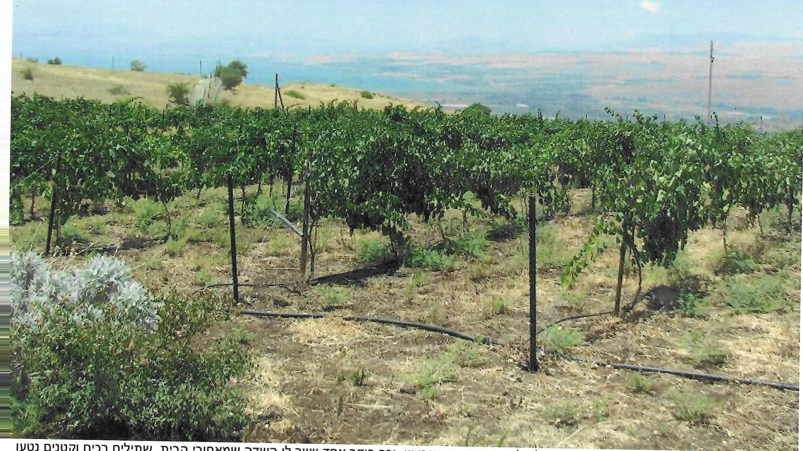
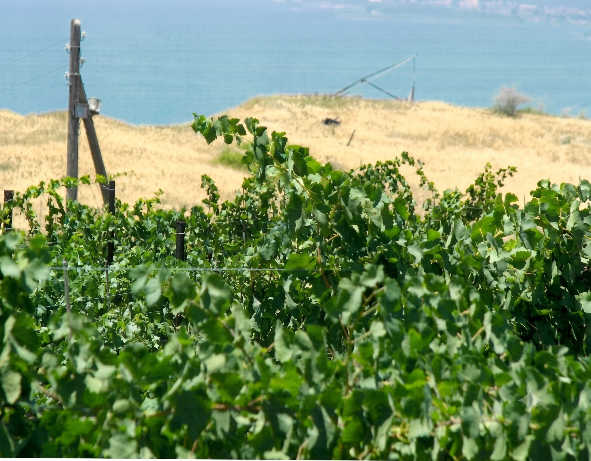
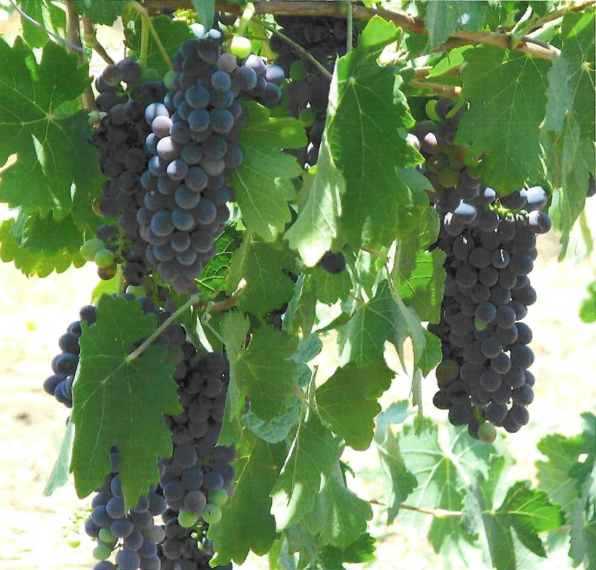
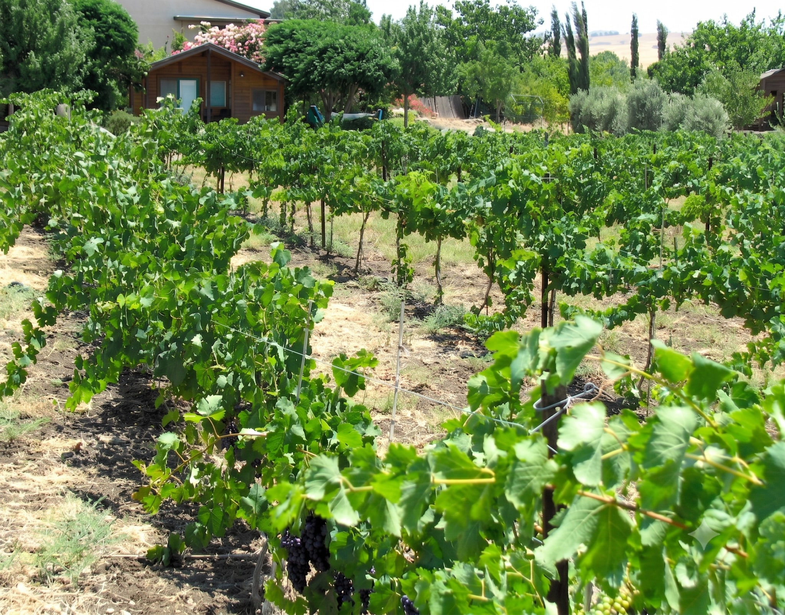

# בורא פרי הגפן...

לח. היה חזון. (לא, לא זה עם העצמות היבשות...) הוא חלם לנטוע כרם. ובו ענבי יין. וכך בוקר אחד יושר לו השדה שמאחורי הבית. שתילים רכים וקטנים נטעו על אדמת הבזלת. ועבר קיץ והגיע עוד אחד. ובוקר אחד גיליתי שאני חיה בטוסקנה...

בבוקר השכם ח. יוצא אל הכרמים (כך בפי הקטנה). מישר את השורות, מלטף את העלים. ונאנח בהנאה רבה למראה הענבים. מי שלא הריח את ריח "הגפנים סמדר" לא חווה ריח נעים מימיו...

והנה הם ענבי השירז. ב"בקבוקים" הטבעיים שלהם. קצת לפני הבציר...עוד כמה ימים נבצור (כלומר ח. יבצור) את הגפנים. ונפיק מהם יין משובח....אז רק בשמחות...

