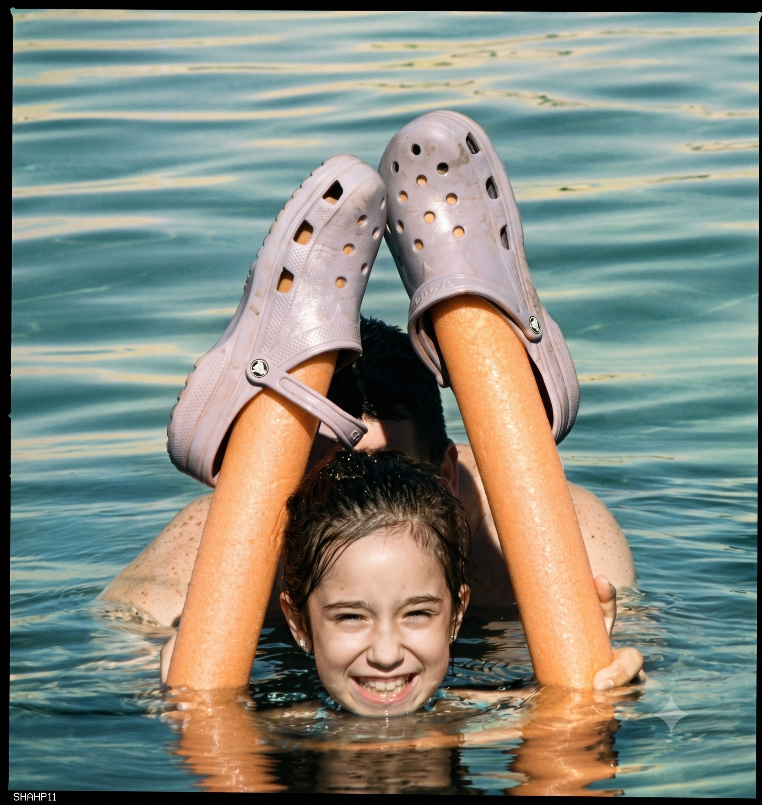
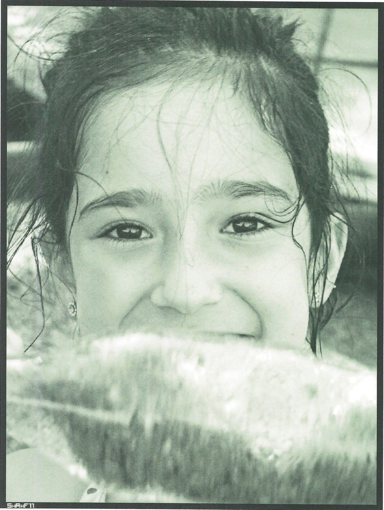
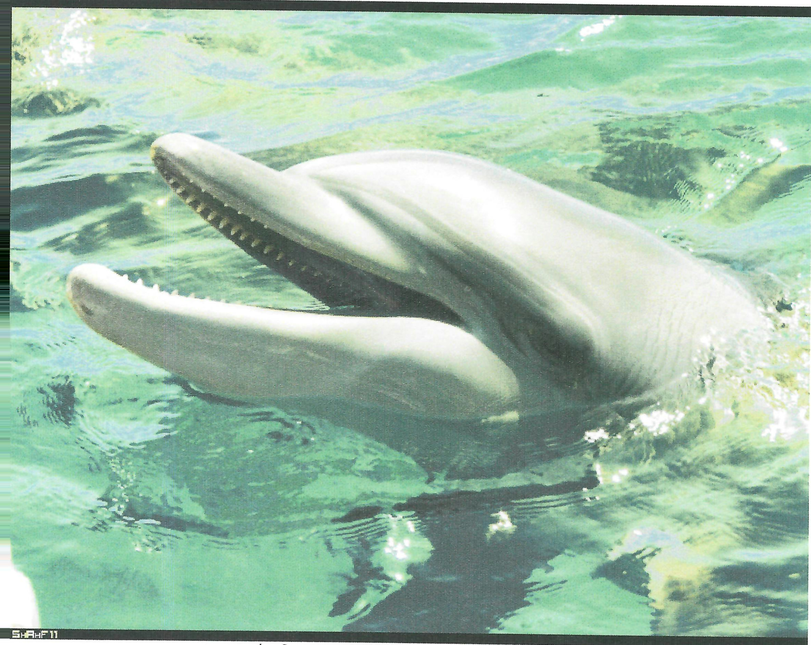
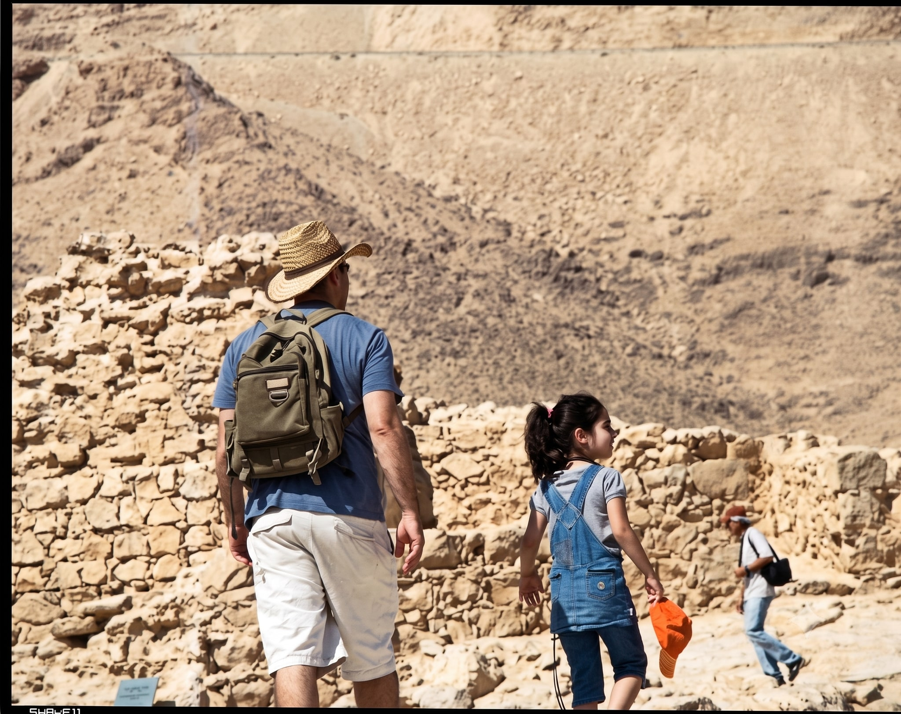
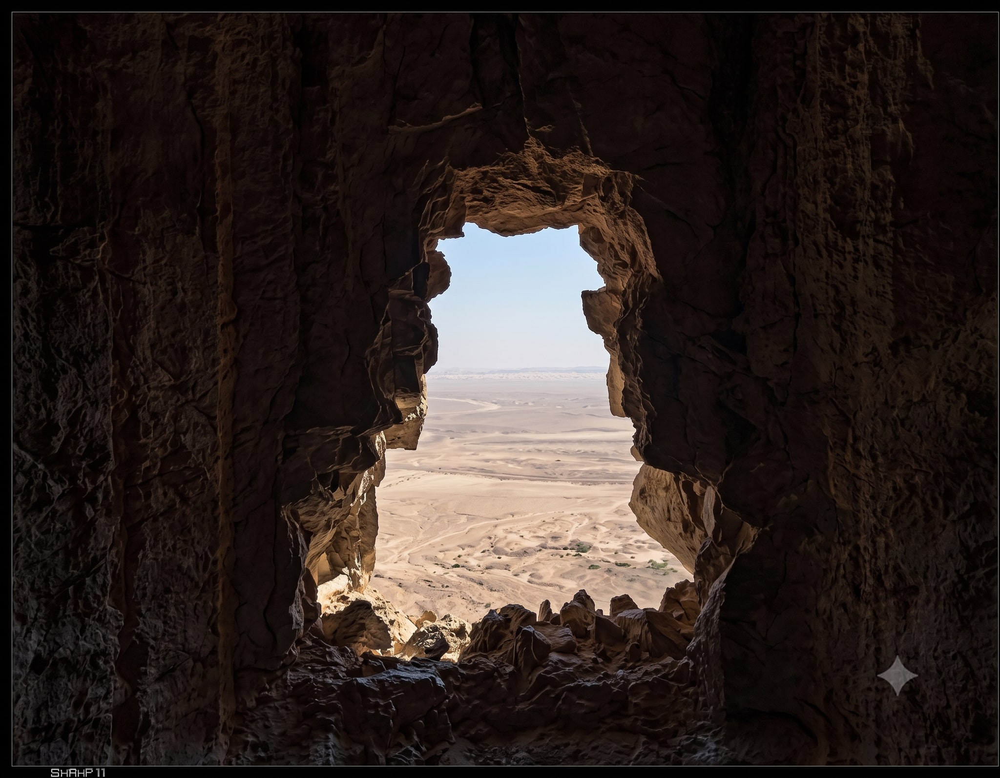
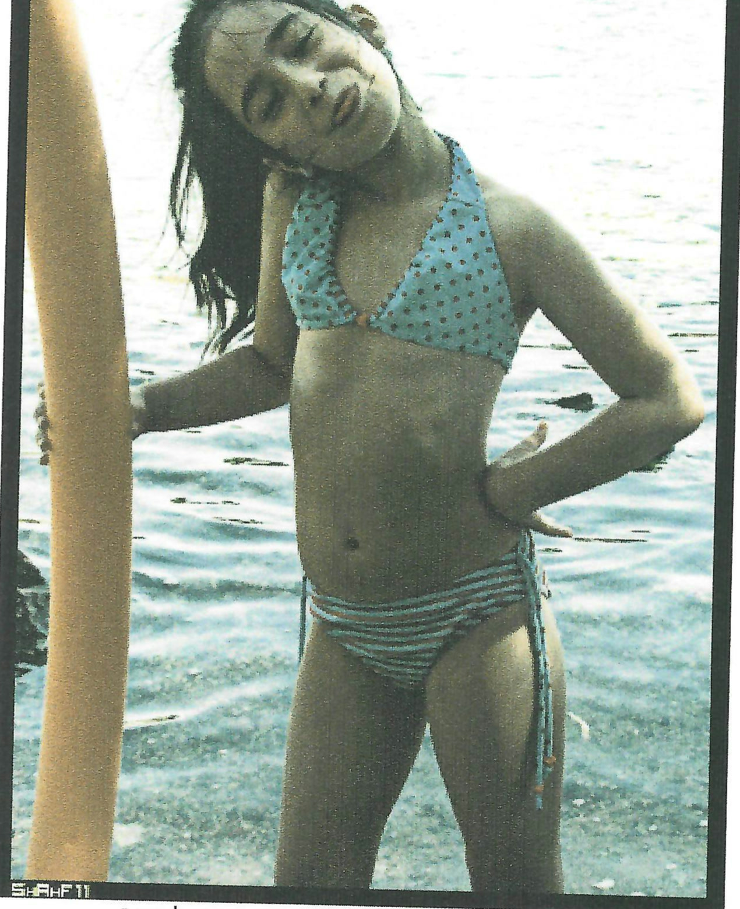
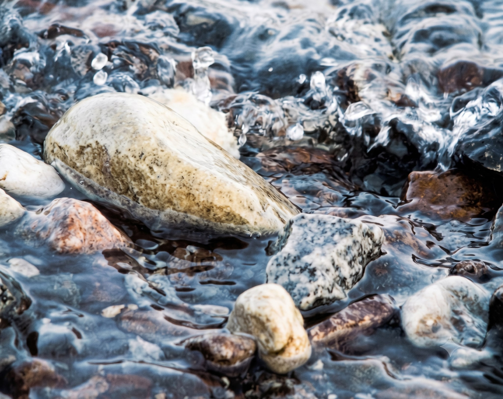

# יש כח ללכת. התמונות. חלק אחרון.

תראו מה שקרוקס יכולים להיות.... בריף הדולפינים באילת. הקטנה והאבא.

אם מכניסים חול לבקבוק והרבה מים קל לבנות ארמונות יצירתיים בחול.

הדולפינים - כל כך חברותים. כל כך אינטליגנטים. בריף יש היום 8 דולפינים.

במצדה - "אמא תראי פינה אדריכלית". כך נעמונת.

ים המלח - נשקף מהמצדה.

מישהי עושה פה חיים. בזמן שכולם בבית הספר לומדים....

חופים הם לפעמים געגועים....הביתה.

שנה נפלאה נפלאה ושוב נפלאה.
לכל האהובים עלי.
שחף.
