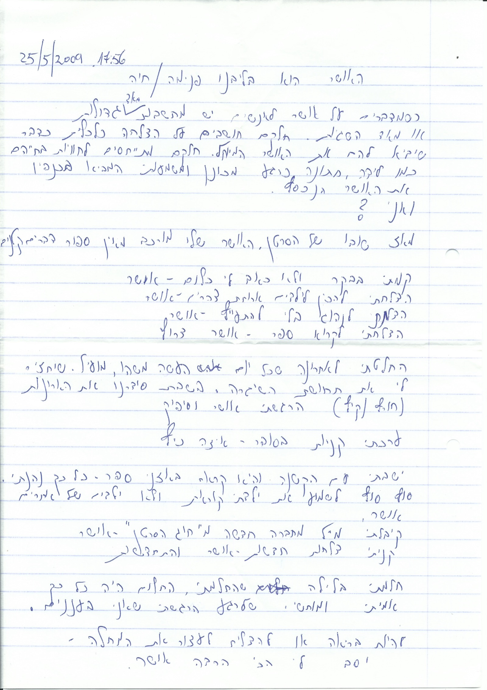

# האושר הוא בליבנו פנימה

כשמדברים על אושר, לאנשים יש מחשבות מאד גדולות או מאד השגיות. חלקם חושבים על הצלחה כלכלית כדבר שיביא להם את האושר המיוחל.

חלקם מתייחסים לחוויות בחייהם כמו לידה,חתונה כרגע מכונן ומשמעותי המביא בכנפיו את האושר הנכסף.

ואני?

מאז שובו של הסרטן, האושר שלי מורכב מאינסוף דברים קטנים.

קמתי בבוקר ולא כאב לי כלום - אושר.

הצלחתי להכין לילדים ארוחת צהריים - אושר.

הצלחתי לנהוג בלי להתעייף - אושר.

הצלחתי לקרא ספר - אושר צרוף.

החלטתי לאחרונה שבכל יום אעשה משהו,מועיל. שיחזיר לי את תחושת השגרה. בשבת סידרנו את הארונות (חורף/קיץ) הרגשתי אושר וסיפוק.

ערכתי קניות בסופר. - איזה כיף.

ישבתי עם הקטנה והיא קראה באזני ספר - כל כך נהניתי. סוף סוף לשמוע את ילדתי קוראת ולא ילדים של אחרים.

אושר.

קיבלתי מייל מחברה חדשה מ"חוג הסרטן" - אושר.

קניתי צלחות חדשות - אושר והתחדשות.

חלמתי בלילה שהחלמתי. החלום היה כל כך אמיתי ומוחשי.

שלרגע הרגשתי שאני בעננים.

להיות בריאה או להצליח לעצור את המחלה. יסב לי הכי הרבה אושר.

